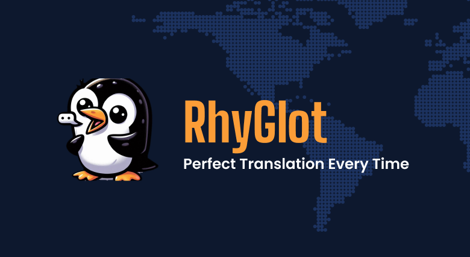

# RhyGlot: AI Translation App

### Demo: https://rhyglot-ai-translator.vercel.app/



## Technologies Used

- **Frontend Framework**: Next.js 14 with App Router
- **Styling**: Tailwind CSS + Shadcn/UI
- **Language**: TypeScript
- **AI Integration**: OpenAI API
- **Deployment**: Vercel

## Key Features

- Real-time AI-powered translation
- Support for multiple languages including English, French, and Filipino
- Modern, responsive UI with dark mode support
- Efficient text processing with OpenAI's GPT models

## Tech Stack Details

### Core Dependencies

- Next.js 14
- React 18
- TypeScript
- Tailwind CSS
- Shadcn/UI Components
- OpenAI API

### UI Components

- Radix UI primitives
- Lucide Icons
- Tailwind CSS Animations

## Getting Started

First, set up your environment variables:

```bash
OPENAI_API_KEY=your_api_key_here
```

Then, install dependencies and run the development server:

```bash
npm install
npm run dev
# or
yarn install
yarn dev
# or
pnpm install
pnpm dev
# or
bun install
bun dev
```

Open [http://localhost:3000](http://localhost:3000) with your browser to see the result.

## Project Structure

- `src/app/` - Main application pages and API routes
- `src/components/` - Reusable UI components
- `public/` - Static assets including images
- `styles/` - Global styles and Tailwind configurations

## Design

View the Figma design: [RhyGlot Design File](<https://www.figma.com/design/tSPwztBnyTSnINlsxctpp0/OpenAi-API---RhyGlot-(Copy)?node-id=0-1&t=vdMsFVtZ9mFAW0Se-1>)

## Font

This project uses [`next/font`](https://nextjs.org/docs/app/building-your-application/optimizing/fonts) to automatically optimize and load [Geist](https://vercel.com/font), a custom font family by Vercel.
